# HandMade — Entity Relationship Diagram

Normalized PostgreSQL schema for Supabase. Soft deletes and audit fields omitted from the diagram for clarity.

```mermaid
erDiagram
  ROLES ||--o{ USERS : has
  ROLES ||--o{ ROLE_PERMISSIONS : grants
  PERMISSIONS ||--o{ ROLE_PERMISSIONS : assigned
  USERS ||--o{ REFRESH_TOKENS : owns
  USERS ||--o{ OTPS : receives
  USERS ||--o{ PASSWORD_RESET_TOKENS : has
  USERS ||--o{ ADDRESSES : has
  USERS ||--o{ CARTS : owns
  USERS ||--o{ WISHLIST : saves
  USERS ||--o{ ORDERS : places
  USERS ||--o{ REVIEWS : writes
  USERS ||--o{ NOTIFICATIONS : receives
  USERS ||--o{ AUDIT_LOGS : performs

  CATEGORIES ||--o{ SUBCATEGORIES : contains
  CATEGORIES ||--o{ PRODUCTS : groups
  SUBCATEGORIES ||--o{ PRODUCTS : groups
  BRANDS ||--o{ PRODUCTS : brands
  PRODUCTS ||--o{ PRODUCT_IMAGES : has
  PRODUCTS ||--o{ PRODUCT_VARIANTS : has
  PRODUCTS ||--o{ INVENTORY : stocks
  PRODUCTS ||--o{ CART_ITEMS : in
  PRODUCTS ||--o{ WISHLIST : in
  PRODUCTS ||--o{ ORDER_ITEMS : sold_as
  PRODUCTS ||--o{ REVIEWS : receives

  ATTRIBUTES ||--o{ ATTRIBUTE_VALUES : has
  PRODUCT_VARIANTS ||--o{ VARIANT_ATTRIBUTE_VALUES : maps
  ATTRIBUTE_VALUES ||--o{ VARIANT_ATTRIBUTE_VALUES : used_in
  PRODUCT_VARIANTS ||--o{ INVENTORY : stocks

  CARTS ||--o{ CART_ITEMS : contains
  COUPONS ||--o{ ORDERS : applied
  COUPONS ||--o{ COUPON_REDEMPTIONS : redeemed
  ORDERS ||--o{ ORDER_ITEMS : contains
  ORDERS ||--o{ PAYMENTS : paid_by
  PAYMENTS ||--o{ TRANSACTIONS : records
  ADDRESSES ||--o{ ORDERS : ships_to

  CORPORATE_ENQUIRIES ||--o{ QUOTATIONS : generates
  QUOTATIONS ||--o{ QUOTATION_ITEMS : contains
  USERS ||--o{ BLOGS : authors

  ROLES {
    uuid id PK
    string name
    string slug UK
    boolean is_system
  }

  PERMISSIONS {
    uuid id PK
    string name
    string slug UK
    string module
  }

  ROLE_PERMISSIONS {
    uuid role_id PK_FK
    uuid permission_id PK_FK
  }

  USERS {
    uuid id PK
    uuid role_id FK
    string email UK
    string password_hash
    string google_id UK
    enum status
    timestamptz email_verified_at
  }

  REFRESH_TOKENS {
    uuid id PK
    uuid user_id FK
    string token_hash UK
    timestamptz expires_at
    timestamptz revoked_at
  }

  OTPS {
    uuid id PK
    uuid user_id FK
    string email
    string code_hash
    enum purpose
    timestamptz expires_at
  }

  CATEGORIES {
    uuid id PK
    string name
    string slug UK
  }

  SUBCATEGORIES {
    uuid id PK
    uuid category_id FK
    string name
    string slug
  }

  BRANDS {
    uuid id PK
    string name
    string slug UK
  }

  PRODUCTS {
    uuid id PK
    uuid category_id FK
    uuid subcategory_id FK
    uuid brand_id FK
    string name
    string slug UK
    numeric base_price
    enum status
    boolean is_featured
    boolean is_trending
  }

  PRODUCT_IMAGES {
    uuid id PK
    uuid product_id FK
    string url
    boolean is_primary
  }

  PRODUCT_VARIANTS {
    uuid id PK
    uuid product_id FK
    string sku UK
    numeric price
  }

  ATTRIBUTES {
    uuid id PK
    string name
    string slug UK
  }

  ATTRIBUTE_VALUES {
    uuid id PK
    uuid attribute_id FK
    string value
  }

  INVENTORY {
    uuid id PK
    uuid product_id FK
    uuid variant_id FK
    int quantity
    int reserved_quantity
  }

  ADDRESSES {
    uuid id PK
    uuid user_id FK
    enum type
    string city
    string country
  }

  CARTS {
    uuid id PK
    uuid user_id FK
    string session_id
  }

  CART_ITEMS {
    uuid id PK
    uuid cart_id FK
    uuid product_id FK
    uuid variant_id FK
    int quantity
  }

  WISHLIST {
    uuid id PK
    uuid user_id FK
    uuid product_id FK
  }

  COUPONS {
    uuid id PK
    string code UK
    enum type
    numeric value
  }

  ORDERS {
    uuid id PK
    string order_number UK
    uuid user_id FK
    uuid coupon_id FK
    enum status
    numeric total_amount
  }

  ORDER_ITEMS {
    uuid id PK
    uuid order_id FK
    uuid product_id FK
    int quantity
    numeric total_price
  }

  PAYMENTS {
    uuid id PK
    uuid order_id FK
    enum method
    enum status
    numeric amount
  }

  TRANSACTIONS {
    uuid id PK
    uuid payment_id FK
    enum type
    numeric amount
  }

  REVIEWS {
    uuid id PK
    uuid product_id FK
    uuid user_id FK
    smallint rating
  }

  BLOGS {
    uuid id PK
    uuid author_id FK
    string slug UK
    enum status
  }

  CMS_PAGES {
    uuid id PK
    string slug UK
    enum status
  }

  FAQS {
    uuid id PK
    string question
    boolean is_active
  }

  BANNERS {
    uuid id PK
    string position
    boolean is_active
  }

  CORPORATE_ENQUIRIES {
    uuid id PK
    string company_name
    enum status
  }

  QUOTATIONS {
    uuid id PK
    string quotation_number UK
    uuid enquiry_id FK
    enum status
  }

  QUOTATION_ITEMS {
    uuid id PK
    uuid quotation_id FK
    int quantity
  }

  NOTIFICATIONS {
    uuid id PK
    uuid user_id FK
    enum type
    timestamptz read_at
  }

  AUDIT_LOGS {
    uuid id PK
    uuid user_id FK
    string action
    string entity_type
  }

  SETTINGS {
    uuid id PK
    string key UK
    jsonb value
  }
```

## Relationship Notes

| Area | Design |
|------|--------|
| **RBAC** | Many-to-many `roles ↔ permissions` via `role_permissions` |
| **Catalog** | Category → Subcategory → Product; Brand optional on Product |
| **Variants** | Product → Variants; attributes via junction `variant_attribute_values` |
| **Inventory** | One row per product or product+variant (`UNIQUE NULLS NOT DISTINCT`) |
| **Cart** | User or guest (`session_id`); items uniquely keyed |
| **Orders** | Address snapshots in JSONB; line items denormalize name/SKU/price |
| **Payments** | Order → Payments → Transactions (ledger-style) |
| **Corporate** | Enquiry → Quotation → Quotation Items |

## Normalization

- **3NF** for catalog, RBAC, and transactional cores
- Controlled denormalization only for order/payment snapshots (immutable history)
- ENUM types for constrained status/method fields
- Soft delete on `users` and `products`
